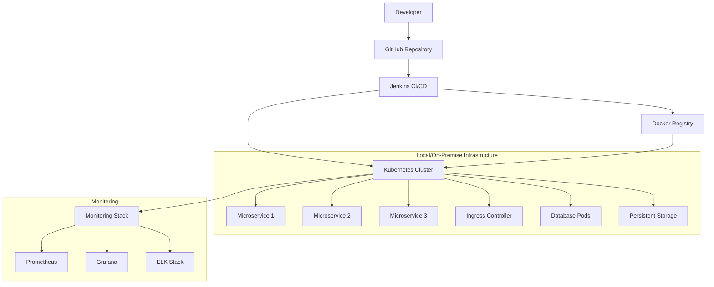
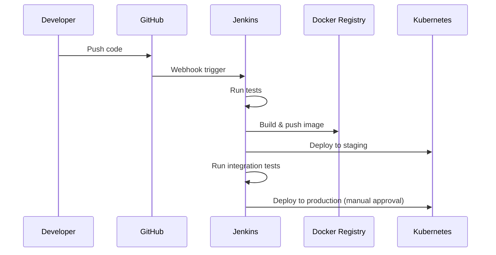

# Design Document

## Overview

Hệ thống DevOps Pipeline cho Microservices được thiết kế như một platform tự động hóa hoàn chỉnh, tích hợp Docker, Kubernetes, Jenkins và GitHub để cung cấp continuous integration và continuous deployment. Kiến trúc được xây dựng theo nguyên tắc GitOps và Cloud Native patterns với local/on-premise infrastructure.

## Architecture

### High-Level Architecture



### Component Architecture

1. **Source Control Layer**: GitHub với branch protection và automated workflows
2. **CI/CD Layer**: Jenkins với pipeline as code và multi-stage deployments
3. **Container Layer**: Docker với multi-stage builds và Docker Hub registry
4. **Orchestration Layer**: Kubernetes cluster (local/on-premise) với Helm charts
5. **Database Layer**: Containerized databases (PostgreSQL, MongoDB, Redis)
6. **Monitoring Layer**: Prometheus, Grafana và ELK stack

## Components and Interfaces

### 1. GitHub Integration

**Components:**

- Repository structure với monorepo cho microservices
- GitHub Actions cho pre-commit checks
- Branch protection rules và required reviews
- Webhook integration với Jenkins

**Interfaces:**

- REST API cho repository operations
- Webhook endpoints cho event notifications
- OAuth integration cho authentication

### 2. Jenkins CI/CD Pipeline

**Components:**

- Master-slave architecture với dynamic agents
- Pipeline as Code với Jenkinsfile
- Multi-branch pipeline support
- Integration với Docker và Kubernetes

**Pipeline Stages:**

```groovy
pipeline {
    agent any
    stages {
        stage('Checkout') {
            steps {
                git branch: 'main', url: 'https://github.com/repo/microservices'
            }
        }
        stage('Test') {
            steps {
                sh 'npm test'
                sh 'npm run lint'
            }
        }
        stage('Build Docker Image') {
            steps {
                sh 'docker build -t microservice:${BUILD_NUMBER} .'
                sh 'docker tag microservice:${BUILD_NUMBER} microservice:latest'
            }
        }
        stage('Security Scan') {
            steps {
                sh 'trivy image microservice:latest'
            }
        }
        stage('Push to Registry') {
            steps {
                sh 'docker push microservice:${BUILD_NUMBER}'
                sh 'docker push microservice:latest'
            }
        }
        stage('Deploy to Staging') {
            steps {
                sh 'helm upgrade --install staging-app ./charts/microservice --set image.tag=${BUILD_NUMBER}'
            }
        }
        stage('Integration Tests') {
            steps {
                sh 'npm run test:integration'
            }
        }
        stage('Deploy to Production') {
            when {
                branch 'main'
            }
            steps {
                input 'Deploy to production?'
                sh 'helm upgrade --install prod-app ./charts/microservice --set image.tag=${BUILD_NUMBER}'
            }
        }
    }
}
```

### 3. Docker Containerization

**Multi-stage Dockerfile:**

```dockerfile
# Build stage
FROM node:16-alpine AS builder
WORKDIR /app
COPY package*.json ./
RUN npm ci --only=production

# Runtime stage
FROM node:16-alpine AS runtime
WORKDIR /app
COPY --from=builder /app/node_modules ./node_modules
COPY . .
EXPOSE 3000
USER node
CMD ["npm", "start"]
```

**Container Registry:**

- Docker Hub cho public/private images
- Image tagging strategy với semantic versioning
- Vulnerability scanning với Trivy
- Multi-architecture builds (AMD64, ARM64)

### 4. Kubernetes Deployment

**Cluster Setup:**

- Local Kubernetes cluster (minikube, kind, hoặc on-premise)
- Ingress controller (NGINX)
- Persistent storage với local volumes
- Network policies cho security

**Helm Chart Structure:**

```
charts/
├── microservice/
│   ├── templates/
│   │   ├── deployment.yaml
│   │   ├── service.yaml
│   │   ├── ingress.yaml
│   │   ├── configmap.yaml
│   │   ├── secret.yaml
│   │   └── hpa.yaml
│   ├── values.yaml
│   ├── values-staging.yaml
│   ├── values-prod.yaml
│   └── Chart.yaml
```

**Kubernetes Resources:**

- Deployments với rolling updates
- Services cho internal communication
- Ingress controllers cho external access
- ConfigMaps và Secrets management
- HorizontalPodAutoscaler cho auto-scaling
- PersistentVolumes cho data storage

### 5. Database Layer

**Containerized Databases:**

```yaml
# PostgreSQL StatefulSet
apiVersion: apps/v1
kind: StatefulSet
metadata:
  name: postgresql
spec:
  serviceName: postgresql
  replicas: 1
  template:
    spec:
      containers:
        - name: postgresql
          image: postgres:13
          env:
            - name: POSTGRES_DB
              value: microservice_db
            - name: POSTGRES_USER
              valueFrom:
                secretKeyRef:
                  name: db-secret
                  key: username
            - name: POSTGRES_PASSWORD
              valueFrom:
                secretKeyRef:
                  name: db-secret
                  key: password
          volumeMounts:
            - name: postgresql-storage
              mountPath: /var/lib/postgresql/data
  volumeClaimTemplates:
    - metadata:
        name: postgresql-storage
      spec:
        accessModes: ["ReadWriteOnce"]
        resources:
          requests:
            storage: 10Gi
```

**Database Options:**

- PostgreSQL cho relational data
- MongoDB cho document storage
- Redis cho caching và sessions
- Backup strategies với CronJobs

### 6. Monitoring và Logging

**Monitoring Stack:**

- Prometheus cho metrics collection
- Grafana cho visualization
- AlertManager cho notifications
- Node Exporter cho system metrics

**Logging Stack:**

- Elasticsearch cho log storage
- Logstash cho log processing
- Kibana cho log visualization
- Fluentd cho log collection từ containers

**Monitoring Configuration:**

```yaml
# Prometheus ConfigMap
apiVersion: v1
kind: ConfigMap
metadata:
  name: prometheus-config
data:
  prometheus.yml: |
    global:
      scrape_interval: 15s
    scrape_configs:
    - job_name: 'kubernetes-pods'
      kubernetes_sd_configs:
      - role: pod
      relabel_configs:
      - source_labels: [__meta_kubernetes_pod_annotation_prometheus_io_scrape]
        action: keep
        regex: true
```

## Data Models

### 1. Application Configuration

```yaml
apiVersion: v1
kind: ConfigMap
metadata:
  name: app-config
data:
  database_url: "postgresql://postgres:5432/microservice_db"
  redis_url: "redis://redis:6379"
  log_level: "info"
  api_timeout: "30s"
```

### 2. Deployment Manifest

```yaml
apiVersion: apps/v1
kind: Deployment
metadata:
  name: microservice
  labels:
    app: microservice
spec:
  replicas: 3
  selector:
    matchLabels:
      app: microservice
  template:
    metadata:
      labels:
        app: microservice
      annotations:
        prometheus.io/scrape: "true"
        prometheus.io/port: "3000"
    spec:
      containers:
        - name: app
          image: microservice:latest
          ports:
            - containerPort: 3000
          env:
            - name: DATABASE_URL
              valueFrom:
                configMapKeyRef:
                  name: app-config
                  key: database_url
          livenessProbe:
            httpGet:
              path: /health
              port: 3000
            initialDelaySeconds: 30
          readinessProbe:
            httpGet:
              path: /ready
              port: 3000
            initialDelaySeconds: 5
```

### 3. Jenkins Pipeline Configuration

```groovy
// Jenkinsfile
pipeline {
    agent {
        kubernetes {
            yaml """
                apiVersion: v1
                kind: Pod
                spec:
                  containers:
                  - name: docker
                    image: docker:latest
                    command:
                    - cat
                    tty: true
                    volumeMounts:
                    - mountPath: /var/run/docker.sock
                      name: docker-sock
                  - name: kubectl
                    image: bitnami/kubectl:latest
                    command:
                    - cat
                    tty: true
                  volumes:
                  - name: docker-sock
                    hostPath:
                      path: /var/run/docker.sock
            """
        }
    }
    environment {
        DOCKER_REGISTRY = 'docker.io'
        IMAGE_NAME = 'microservice'
        KUBECONFIG = credentials('kubeconfig')
    }
    stages {
        // Pipeline stages here
    }
}
```

## Error Handling

### 1. Pipeline Failures

**Build Failures:**

- Automatic retry với exponential backoff
- Notification qua Slack/email webhook
- Rollback mechanism cho failed deployments
- Build artifact cleanup

**Deployment Failures:**

- Kubernetes health checks và readiness probes
- Automatic rollback với Helm
- Circuit breaker pattern cho service dependencies

### 2. Runtime Errors

**Application Errors:**

- Graceful shutdown handling
- Error logging với structured format
- Automatic restart policies trong Kubernetes
- Health check endpoints

**Infrastructure Errors:**

- Node failure handling với pod rescheduling
- Storage failure recovery với backup restoration
- Network partition handling

### 3. Security Incidents

**Vulnerability Detection:**

- Container image scanning với Trivy
- Dependency vulnerability checking
- Security policy enforcement với OPA Gatekeeper

**Access Control:**

- RBAC trong Kubernetes
- Service mesh security với Istio (optional)
- Network policies cho pod communication

## Testing Strategy

### 1. Unit Testing

**Framework Integration:**

- Jest cho JavaScript/TypeScript
- JUnit cho Java applications
- Coverage reporting với SonarQube
- Parallel test execution

### 2. Integration Testing

**Service Testing:**

- Contract testing với Pact
- API testing với Postman/Newman
- Database integration tests với testcontainers

**Container Testing:**

- Docker image testing với Container Structure Test
- Kubernetes manifest validation với kubeval
- Helm chart testing với helm test

### 3. End-to-End Testing

**Automated E2E:**

- Selenium cho web applications
- API testing với REST Assured
- Performance testing với JMeter
- Chaos engineering với Chaos Monkey

### 4. Security Testing

**Static Analysis:**

- SAST tools trong CI pipeline
- Dependency vulnerability scanning
- Infrastructure security scanning với kube-score

**Dynamic Testing:**

- DAST tools cho running applications
- Penetration testing automation
- Runtime security monitoring

## Deployment Strategy

### 1. GitOps Workflow



### 2. Environment Promotion

**Development → Staging → Production:**

- Feature branch deployments cho development
- Automatic staging deployment từ main branch
- Manual approval gates cho production
- Rollback capabilities ở mọi stage

### 3. Blue-Green Deployment

**Zero-downtime Deployments:**

- Parallel environment setup với Kubernetes namespaces
- Traffic switching với Ingress controller
- Automatic rollback nếu health checks fail
- Database migration strategies
